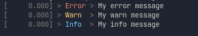

# Morgan

`Morgan` is a light weight implementation on top of the [log crate](https://crates.io/crates/log).

Instead of showing the current time in the log, it shows the time since application startup in seconds.

## Usage

Run:
```
git submodule add git@github.com:lholznagel/morgan.git
```

Cargo.toml:
```
morgan = { path = "../morgan" }
```

Code:
``` rust
use morgan::Morgan;

fn main() {
    Morgan::init(Vec::new()); // or vec!["dependency_to_ignore_logs_from"]

    log::error!("My error message");
    log::warn!("My warn message");
    log::info!("My info message");
    log::debug!("Will not be shown");
    log::trace!("Will not be shown");
}
```

## Defaults

- Log level: `INFO`
- Color output: `true`
- Crates excluded: `[]`
  - To add some go to [lib.rs](./src/lib.rs#4)

## Env

- `MORGAN_LEVEL=debug` changes the log level to debug
- `MORGAN_COLOR=false` disables color output

## Example output

[](./assets/morgan.png)

